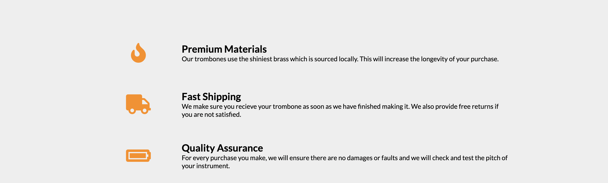
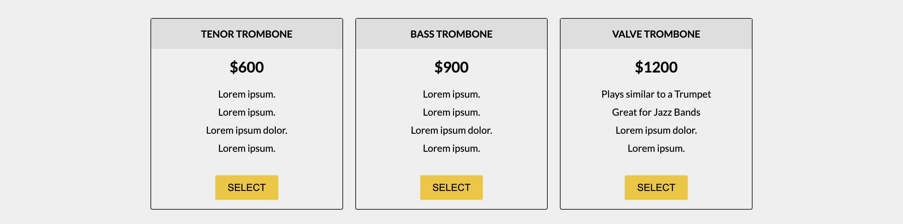
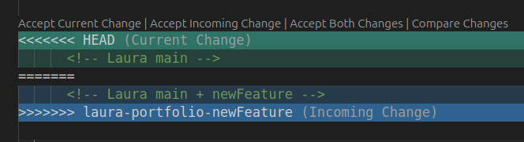
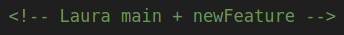

# Trombone Landing Page

You have been tasked with building a site that sells nice trombones. There will be some 

<div style="align:center">
    
</div>


All of our code is going to be inside `<div id="page-wrapper">`. Try to do each section the best you can. At the end, you can compare with the finished project and compare.

#### Section 1 - Header


Following the box model, you can clearly see that the section is divided into two parts, the `logo` and the `navigation`. </br>

First let's focus on the right side (the navigation). Like we saw in the prev excersices, this is shown as `<ul>`. Lets add the `features`, `How it works`, and `Pricing`. Remember to wrap the `<ul>` with a `<nav>`, and to add `nav-link` as the className for the `a` tag. </br>
For href: `Features => "#features"` & `How It Works => #how-it-works` & `Pricing => #pricing`. 

```html
<header id="header">
    <!-- add the logo here -->
    <nav id="nav-bar">
        <ul>
            <li>
                <a class="nav-link" href="#features">Features</a>
            </li>
            ...
        </ul>
    </nav>
</header>
```

Now, for the left side, let's add an image that you can get at the url `"https://cdn.freecodecamp.org/testable-projects-fcc/images/product-landing-page-logo.png"`. We can render the image with a url using the `````` tag. Read more about it on [MDN]()
Go ahead add the `````` tag in. Remember to use `header-img` as the id for the `img` tag.  </br>
It looks a little bigger than the img right? Wrap it in ```<div class="logo"></div>```. Now it should look like the left side of the navbar.


#### Section 2 - Header


For this header we will create a `<section id="hero"></section>` that will contain the form. Then we will add the following snippet (the form) inside this section:

```html
            <form id="form" action="https://www.freecodecamp.com/email-submit">
              <input
                name="email"
                id="email"
                type="email"
                placeholder="Enter your email address"
                required
              />
              <input id="submit" type="submit" value="Get Started" class="btn" />
            </form>
```

#### Section 3 - Features



Keep the features code inside `<div class="container">` and `<section id="features">`.  

```html
    <div class="container">
        <section id="features">

        </section>
    </div>
```

Each feature will be formatted like
```html
    <div class="grid">
        <div class="icon"><i class="fa fa-3x fa-fire"></i></div>
        <div class="desc">
            <h2>Premium Materials</h2>
            <p>
            Our trombones use the shiniest brass which is sourced locally.
            This will increase the longevity of your purchase.
            </p>
        </div>
    </div>
```
Here are the links to the other icons. `<i class="fa fa-3x fa-truck"></i>` and `<i class="fa fa-3x fa-battery-full" aria-hidden="true"></i>`

⚠️ the icons are availables thanks to the following tag, that is already present in the practice file.
```html
    <link
      rel="stylesheet"
      href="https://use.fontawesome.com/releases/v5.8.1/css/all.css"
      integrity="sha384-50oBUHEmvpQ+1lW4y57PTFmhCaXp0ML5d60M1M7uH2+nqUivzIebhndOJK28anvf"
      crossorigin="anonymous"
    />
```


#### Section 4 - IFRAME


Iframes are a good way to run another website or another. Try this example

```html
    <section id="how-it-works">
        <iframe
        id="video"
        height="315"
        src="https://en.wikipedia.org/wiki/Emmi_It%C3%A4ranta"
        frameborder="0"
        allowfullscreen
        >
        </iframe>
    </section>
```
It bring the wikipedia webpage into your html page. For our example use `https://www.youtube-nocookie.com/embed/y8Yv4pnO7qc?rel=0&amp;controls=0&amp;showinfo=0`

Read more about [IFRAMES](https://developer.mozilla.org/en-US/docs/Web/HTML/Element/iframe)

#### Section 5 - Pricing



Keep the pricing code inside `<section id="pricing"></section>`, and inside of it, add the price blocks.

Each price block will look like this

```html
    <div class="product" id="tenor">
        <div class="level">Tenor Trombone</div>
        <h2>$600</h2>
        <ol>
            <li>Lorem ipsum.</li>
            <li>Lorem ipsum.</li>
            <li>Lorem ipsum dolor.</li>
            <li>Lorem ipsum.</li>
        </ol>
        <button class="btn">Select</button>
    </div>
```

#### Section 6 - Footer

Add a footer as the last piece now. The `ul` part of it will look like 

```html
    <footer>
        <ul>
        <li><a href="#">Privacy</a></li>
        ...
        </ul>
        <span>Copyright 2016, Original Trombones</span>
    </footer>
```


### 2. Publish two versions

Open the integrated terminal in vs code, make sure you navigate to the personal-portfolio directory, and run:


1st version on your personal main branch <your-name>-portfolio-main:
`git add index.html`
`git commit -m "landing page initial version"`
`git push --set-upstream origin <your-name>-portfolio-main`

copy index.html

create 2nd version from main:
`git checkout main`
`git checkout -b <your-name>-portfolio-newFeature`
paste your index.html and make a change: add your name in the footer
`git commit -m "landing page v2: add name"`
`git push --set-upstream origin <your-name>-portfolio-newFeature`

Now you have two versions of your page:
 - <your-name>-portfolio-main       (your main branch)
 - <your-name>-portfolio-newFeature (your draft for new features)

Let's say you want to add the new feature onto your main branch. You will need to merge <your-name>-portfolio-newFeature on <your-name>-portfolio-main
`git checkout <your-name>-portfolio-main`
`git merge <your-name>-portfolio-newFeature`

You will see a message on the terminal:
***Auto-merging html/product-landing-page-done/index.html***
***CONFLICT (content): Merge conflict in html/product-landing-page-done/index.html***
***Automatic merge failed; fix conflicts and then commit the result.***

This message is telling you there's a merge conflict.
The merge created a conflict because you are trying to merge two versions of the same file.

ADD ILLUSTRATION

Now in order to add the new feature onto your main branch, you will need to fix the conflict. 
Open the index.html, you will see this:


Now remove the 3 lines:
 - `>>>>>> HEAD`
 - `======` 
 - `>>>>>> <your new feature branch name>`

And readjust the file to the version with the new feature


Save, and push.
`git add index.html` (from directory "html/product-landing-page-done")
`git commit -m "merge my "`
`git add index.html`
`git commit -m "merging the new feature"`
`git push`